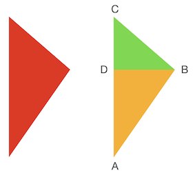
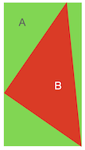

# 三角形绘制

> 本章节算法和代码引用了  Dmitry V. Sokolov 的 [tinyrenderer](https://github.com/ssloy/tinyrenderer) 第二章三角形光栅化过程。在原算法的基础上，本章节做了整理、改进和重构。感谢 Dmitry V. Sokolov 将这一段算法整理成册，并开源地发布在 GitHub 供所有人使用。

在上一章节中，我们描述了基本的线段绘制的算法。线段是所有直线，射线，以及曲线的基本构成单元。对于一条曲线来说，我们可以通过利用微积分的思想，将曲线转换为一条一条细小的线段，通过控制线段的数量来控制曲线的平滑精度。而对于一个曲面来说，我们则可以通过渲染无数个细小的三角形来拟合。

我们在此章节中，将会探索在2D平面下的三角形渲染。在掌握了2D三角形渲染的方法以后，对于一个立体的3D图形，无非通过投影变换将三维空间转换为二维平面，然后重复这个渲染过程。

## 空心三角形渲染

我们已经利用Bresenham算法实现了`DrawLine`函数，对于空心三角形的绘制，无非是三角形三个端点使用`DrawLine`进行三次线段绘制。

```cpp
void DrawTriangleFrame(Image &img, Vector2f p1, Vector2f p2, Vector2f p3,
                       Color color) {
  DrawLine(img, p1, p2, color);
  DrawLine(img, p2, p3, color);
  DrawLine(img, p3, p1, color);
}

int main() {
  auto img = Image(200, 200);
  DrawTriangleFrame(img, Vector2f(0.2f, 0.2f), Vector2f(0.6f, 0.6f),
                    Vector2f(0.3f, 0.6f), Color::Red());
  DrawTriangleFrame(img, Vector2f(0.2f, 0.5f), Vector2f(0.1f, 0.8f),
                    Vector2f(0.2f, 0.9f), Color::Green());
  img.SaveAsPNG("triangle-frame.png");
  return 0;
}
```

运行该程序我们就可以得到一个空心三角形。


## 扫描线算法

通过线段绘制的办法，我们已经得到了一个空心的三角形。而对于实心三角形来说，一个朴素的想法是，我们从下至上，如同填色一样，一条线一条线的补全颜色，直到绘制完成整个三角形。

由于我们不断的在三角形内部从左至右扫描并填，这个算法被称之为扫描线算法。现在让我们来讨论扫描线算法的实现细节。

第一步，我们将三角形切分为上下两部分。



如上图所示，红色的三角形被经过B点的水平线，分成了上下两部分。上部分三角形由线段AC，BC和水平线BD围成，下半部分三角形则由AC，AB和水平线BD围成。A，B，C三点的确定只需要根据三角形的三个端点的y坐标从低到高排序即可。

如果A和B处于同一水平线，y值相等，那么我们可以认为其下半部分ABD（或上半部分BDC）为空三角形，而只存在上半部分（或下半部分）三角形。

经过如此切分以后，三角形的三条线段的方程都是已知的。那么我们关注三角形ABD，我们下往上，在线段AD上寻找一个点，然后做水平线，与AB相交，这条线段即我们的扫描线。这根扫描线明显处于三角形内部，那么我们把其经过的所有像素着色即可。

我们用C++代码来表述这一过程：

```cpp
// 已知线段的两个端点，当一个点在线段上，并已知其y值，求x值
int SolveLineX(Vector2i p1, Vector2i p2, int y) {
  // p1.y和p2.y应不相等，我们在扫描线循环中，规避了相等情况
  assert(p1.y != p2.y);

  auto t = (y - p1.y) / (float)(p2.y - p1.y);
  return t * (p2.x - p1.x) + p1.x;
}

void DrawTriangle(Image &img, Vector2f p1, Vector2f p2, Vector2f p3,
                  Color color) {
  // 将屏幕坐标转换到像素空间
  auto p1i = Vector2i(p1.x * img.Width(), p1.y * img.Height());
  auto p2i = Vector2i(p2.x * img.Width(), p2.y * img.Height());
  auto p3i = Vector2i(p3.x * img.Width(), p3.y * img.Height());

  // 将三角形三个坐标按y轴从低到高排序
  if (p1i.y > p2i.y)
    std::swap(p1i, p2i);
  if (p1i.y > p3i.y)
    std::swap(p1i, p3i);
  if (p2i.y > p3i.y)
    std::swap(p2i, p3i);

  // 扫描下半部分三角形，如果三角形水平，p1i.y == p2i.y
  // 则该循环被跳过
  for (auto y = p1i.y; y < p2i.y; y++) {
    auto xMin = SolveLineX(p1i, p3i, y);
    auto xMax = SolveLineX(p1i, p2i, y);
    DrawLine(img, Vector2i(xMin, y), Vector2i(xMax, y), color);
  }

  // 扫描上半部分三角形，如果三角形水平，p2i.y == p3i.y
  // 则该循环被跳过
  for (auto y = p2i.y; y < p3i.y; y++) {
    auto xMin = SolveLineX(p1i, p3i, y);
    auto xMax = SolveLineX(p2i, p3i, y);
    DrawLine(img, Vector2i(xMin, y), Vector2i(xMax, y), color);
  }
}

int main() {
  auto img = Image(200, 200);
  DrawTriangle(img, Vector2f(0.2f, 0.2f), Vector2f(0.6f, 0.6f),
               Vector2f(0.3f, 0.6f), Color::Red());
  DrawTriangle(img, Vector2f(0.2f, 0.5f), Vector2f(0.1f, 0.8f),
               Vector2f(0.2f, 0.9f), Color::Green());
  img.SaveAsPNG("line-sweeping.png");
  return 0;
}
```

运行代码得到


## 包围盒测试算法

扫描线算法是一个非常老牌的算法，其不仅用于三角形绘制，同时还被大量应用于计算几何中。扫描线算法被大量应用于曾经的单线程CPU架构中，然而随着GPU的发展，带来了数千GPU线程同时绘制图形的方案，一个更适合多线程的包围盒测试算法应运而生。

我们用一张图片来解释包围盒测试：



如图所示，绿色的长方形是红色三角形的包围盒。包围盒是这样一个长方形，其长和宽于x轴和y轴平行，并且其刚刚好围住了内部的三角形。很显然，包围盒的最小或最大x值是三角形三个端点中最小或最大的x，同理y也是如此。

如果一个点处于包围盒之外，很显然它一定处于三角形之外。而一个处于包围盒之内的点，则有可能出现在三角形之内（B点），或出现在三角形之外（A点）。

因此，我们仅仅只需遍历包围盒中的所有像素，并测试其是否在三角形之内，如果之内，则着色，否则则跳过该像素。

用C++代码表述如下：

```cpp
void DrawTriangle(Image &img, Vector2f p1, Vector2f p2, Vector2f p3,
                  Color color) {
  // 将屏幕坐标转换到像素空间
  auto p1i = Vector2i(p1.x * img.Width(), p1.y * img.Height());
  auto p2i = Vector2i(p2.x * img.Width(), p2.y * img.Height());
  auto p3i = Vector2i(p3.x * img.Width(), p3.y * img.Height());

  // 找到包围盒左下和右上两个端点
  auto min = BBoxMin(p1i, p2i, p3i);
  auto max = BBoxMax(p1i, p2i, p3i);

  // 循环包围盒内所有像素，并测试是否在三角形内
  for (auto x = min.x; x <= max.x; x++)
    for (auto y = min.y; y <= max.y; y++) {
      if (!IsInsideTriangle(p1i, p2i, p3i, Vector2i(x, y)))
        continue;
      img.SetColor(x, y, color);
    }
}

int main() {
  auto img = Image(200, 200);
  DrawTriangle(img, Vector2f(0.2f, 0.2f), Vector2f(0.6f, 0.6f),
               Vector2f(0.3f, 0.6f), Color::Red());
  DrawTriangle(img, Vector2f(0.2f, 0.5f), Vector2f(0.1f, 0.8f),
               Vector2f(0.2f, 0.9f), Color::Green());
  img.SaveAsPNG("bbox.png");
  return 0;
}
```
